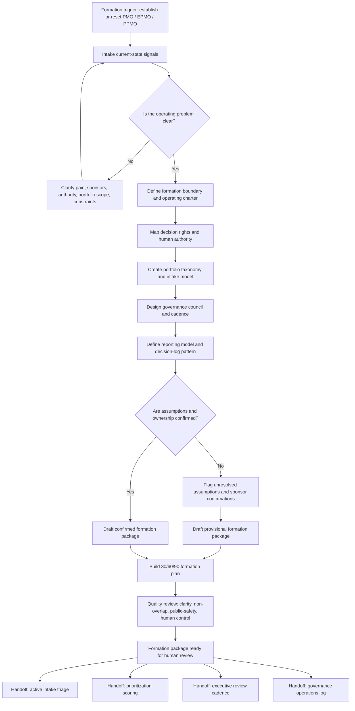

# PPMO Formation Kit: PMO, EPMO, and Portfolio Governance Setup System

A lightweight, human-governed ChatGPT Project package for establishing or resetting a PMO, EPMO, PPMO, transformation office, or portfolio governance function without starting with template sprawl.

## Portfolio exhibit

| Review question | Where to look |
|---|---|
| Status | Public portfolio prototype for ChatGPT Project use and PMO formation review. |
| Best evaluator | PMO, EPMO, PPMO, transformation office, portfolio governance, or executive operations leaders setting up the operating container before active intake begins. |
| Operating decision supported | What decision rights, intake shape, taxonomy, council cadence, reporting model, and first 90-day setup path should exist before the portfolio starts treating demand as governed work? |
| Concrete example | [`examples/sample-output.html`](examples/sample-output.html) shows a synthetic formation package created from the sample scenario. |
| Before / after proof | Before: leaders have scattered initiatives, unclear sponsorship, and template requests. After: the portfolio has a proposed operating charter, decision-rights model, intake design, taxonomy, council model, reporting shape, and 30/60/90 plan for human review. |
| Boundary | This kit forms the operating container. It does not operate the portfolio, score initiatives, approve headcount, approve funding, or assign executive authority. |
| Portfolio lane | [Set up the PPMO intake lane](https://policani.net/#navigator). |

## Operating problem

Organizations often try to form a PMO or PPMO by creating templates before clarifying the operating model. The result is predictable: unclear decision rights, inconsistent intake, weak sponsorship, no portfolio taxonomy, overloaded governance meetings, competing executive priorities, and reporting that describes activity without enabling tradeoffs.

This package helps leaders define the minimum viable governance structure needed to make work visible, comparable, sponsor-owned, and decision-ready.

## Who it is for

- PMO, EPMO, PPMO, transformation office, and portfolio governance leaders
- CIO, CFO, COO, CTO, and chief-of-staff teams establishing portfolio cadence
- Program and portfolio leaders inheriting fragmented initiative sets
- Consultants designing a practical governance operating model
- AI workflow builders looking for a public-safe example of human-governed management-system design

## What it does

The kit turns rough formation notes, leadership concerns, current-state pain points, initiative inventory samples, and governance expectations into a PPMO formation package:

- Operating charter
- Decision-rights model
- Intake model
- Portfolio taxonomy
- Governance council design
- Reporting model
- Decision log pattern
- Initial evidence and assumption register
- 30/60/90 formation plan
- Handoff map into downstream portfolio governance modules

## What it does not do

This kit forms the operating model for a PMO, EPMO, PPMO, transformation office, or portfolio governance function. It does not approve an organization design, assign staff, commit funding, approve priorities, accept risk, replace PPM software, or claim authority over executives.

## How to use this in ChatGPT

Create a new ChatGPT Project and upload **only the files inside `chatgpt-project/`**.

Do not upload the full repository into ChatGPT. The other folders are for GitHub review, examples, workflow source, and package validation.

Recommended first prompt:

```text
Start a PPMO formation session. Use the intake file first. I am establishing or resetting a portfolio governance function. Help me clarify the operating problem, decision rights, intake model, taxonomy, governance cadence, reporting model, and 30/60/90 formation plan before drafting outputs.
```

## Full-repository use for Codex or local work

Use the full repository when you want to inspect the package, review sample outputs, copy examples, or publish the project to GitHub. No software installation is required. There is no configuration file and no local dependency chain.

Suggested local review sequence:

1. Read `README.md`.
2. Upload only `chatgpt-project/` into ChatGPT.
3. Review `examples/sample-data.html` for the synthetic scenario.
4. Use `examples/sample-prompts.html` to run the workflow.
5. Compare results with `examples/sample-output.html`.
6. Review `quality-review/package-test-results.html` before publishing.

## Module boundary

| Boundary element | Definition |
|---|---|
| This module starts when | An organization needs to establish, reset, or formalize a PMO, EPMO, PPMO, transformation office, or portfolio governance function. |
| This module ends when | A formation package exists with operating charter, decision rights, intake model, portfolio taxonomy, governance council design, reporting model, decision-log pattern, and 30/60/90 plan. |
| This module produces | The formation artifacts needed to begin governed operation. |
| This module hands off to | Portfolio Intake and Readiness Triage System, Portfolio Prioritization Scoring Agent, Executive Portfolio Review Pack Builder, and PMO Governance Operations Log. |
| This module does not | Build a full maturity model, approve org design, assign headcount, approve executive authority, or operate the portfolio after launch. |

## Adjacent module fit

| Lifecycle position | Module | Owned work | Handoff relationship |
|---|---|---|---|
| Reference language | Operating Patterns | Reusable governance and operating-model patterns | Supplies phrasing and reusable concepts without becoming the runtime. |
| Formation | **PPMO Formation Kit** | Decision rights, intake shape, taxonomy, council design, reporting model, and 30/60/90 formation plan | Creates the operating container for downstream governance. |
| Active demand entry | Portfolio Intake and Readiness Triage System | Classifies and routes incoming work | Receives the intake model, taxonomy, and readiness fields. |
| Portfolio tradeoff support | Portfolio Prioritization Scoring Agent | Scores approved demand against criteria, constraints, risks, and dependencies | Receives taxonomy, scoring boundaries, and decision-right assumptions. |
| Executive cadence | Executive Portfolio Review Pack Builder | Produces executive review packets, decision agendas, and portfolio health views | Receives council cadence, reporting model, and decision-log structure. |
| Operating follow-through | PMO Governance Operations Log | Captures decisions, actions, risks, escalations, and follow-up | Receives decision-log pattern and carry-forward rules. |

## Workflow



The same Mermaid source is available at `workflow/workflow.mmd`.

## Folder structure

```text
ppmo-formation-kit/
  README.md
  AGENTS.md
  LICENSE.md
  .gitignore
  chatgpt-project/
    start-here.md
    operating-model.md
    trigger-map.md
    ppmo-formation-intake.md
    decision-rights-model.md
    portfolio-taxonomy.md
    governance-council-design.md
    intake-model.md
    reporting-model.md
    thirty-sixty-ninety-plan.md
    output-templates.md
    handoff-rules.md
    working-session-prompts.md
    quality-review-rubric.md
    privacy-human-control.md
  examples/
    sample-data.html
    sample-prompts.html
    sample-output.html
  workflow/
    workflow.mmd
  quality-review/
    package-test-results.html
```

## Runtime file count and constraints

- Runtime folder: `chatgpt-project/`
- Runtime files: 15
- Runtime structure: flat; no nested folders
- Runtime file cap: under 25 files
- Configuration: absent; no configuration required
- Local tooling: absent; no dependency installation required
- Human-readable repository files: HTML except allowed Markdown files and Mermaid source

The runtime uses 15 files because PPMO formation needs separate operating surfaces for decision rights, taxonomy, intake, council design, reporting, and 30/60/90 planning. It remains below the normal and absolute caps.

## Primary outputs

1. PPMO formation brief
2. Operating charter
3. Decision-rights matrix
4. Portfolio taxonomy
5. Intake model
6. Governance council design
7. Reporting model
8. Decision-log pattern
9. Assumption and evidence gap list
10. 30/60/90 formation plan
11. Handoff brief for downstream portfolio governance modules

## Examples

- Synthetic sample data: `examples/sample-data.html`
- Sample working prompts: `examples/sample-prompts.html`
- Sample formation output: `examples/sample-output.html`

The example uses a fictional SaaS company with 500 initiatives, unclear sponsor ownership, no portfolio baseline, and competing CIO/CFO/COO priorities. It contains no employer-private, client-private, financial-private, personal, security-sensitive, or proprietary information.

## Human-control statement

This package supports intake, classification, synthesis, drafting, review, and decision support. Human leaders retain accountability for executive authority, organizational design, funding, staffing, risk acceptance, prioritization, communications, and operating commitments.

## License

Source code and scripts are licensed under MIT. Documentation, prompts, templates, examples, and other non-code materials are licensed under CC BY 4.0 with attribution to Marco Policani. See `LICENSE.md`.

## Search keywords

PMO formation, PPMO formation, EPMO setup, portfolio governance, PMO operating model, transformation office, governance council, decision rights, portfolio taxonomy, project intake model, executive portfolio cadence, PMO charter, portfolio reporting model, human-governed AI, ChatGPT Project, AI-assisted PMO.
